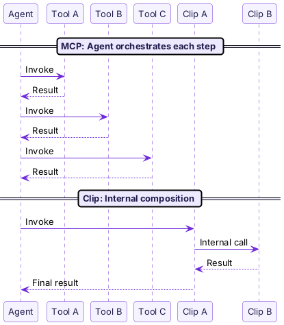

import { Aside } from "@astrojs/starlight/components";

You may have used MCP Tools to add tools to Claude, or written CLI scripts directly for automation. Clips solve similar problems, but make different tradeoffs.

## Comparison Overview

| | Clip | MCP Tool | CLI Script |
|---|---|---|---|
| **Used by** | Agent + human | Agent | Human |
| **Self-description** | Structured manifest (commands, parameter types, matching patterns) | Plain-text description | man page / --help |
| **Composable** | Clips invoke Clips through Hub routing | Cross-tool calls are not supported | shell pipe |
| **Lifecycle management** | daemon manages processes and restarts automatically after crashes | Each server manages itself | None |
| **Distribution** | Registry + Marketplace + one-command installation | Manual JSON configuration | Manual copy |
| **Device capabilities** | Edge Clips (browser, screenshots, clipboard) | Requires implementing your own server | Requires writing it yourself |
| **Sharing** | Marketplace sharing + per-call billing | Not supported | Not supported |
| **State model** | Stateless per invocation | Server-managed state | Has session |

## Key Differences

### 1. Agents Can Use Clips Directly

An MCP Tool has a text description, so the Agent has to guess when to use it.

A Clip has a **structured manifest**. Command names, parameter types, and matching patterns are all machine-readable. The Agent does not need to guess; it can match directly.

```json
// MCP Tool
{ "name": "search_twitter", "description": "Search Twitter for tweets" }

// Clip manifest
{
  "commands": [{
    "name": "search",
    "description": "Search tweets",
    "patterns": ["search twitter", "find tweets about"],
    "input": {
      "query": { "type": "string", "required": true },
      "sort": { "type": "string", "enum": ["recent", "hot", "relevant"] }
    }
  }]
}
```

### 2. Clips Can Compose

MCP Tools are isolated. Your Twitter Tool cannot invoke your Browser Tool. For multi-step operations, the Agent must orchestrate each step.

Clips can invoke each other. A Twitter Clip can call a Browser Clip directly, without involving the Agent in the intermediate steps.



Fewer round trips, fewer tokens, and the Agent does not need to understand the intermediate details.

### 3. Clips Have a Complete Runtime

With CLI scripts, you manage processes yourself. With MCP servers, you configure startup yourself.

Clips have the pinix daemon. It pulls, starts, monitors, and restarts them for you. One command, `pinix hub add @pinix/todo`, is enough. You do not need to configure JSON manually or write a systemd service.

### 4. Distribution and Sharing Are Built In

MCP has no standard package management. Each MCP server must be configured manually in `claude_desktop_config.json`.

Clips have a Registry for publishing code packages and a Marketplace for sharing running instances. Installation takes one command, and shared Clips can charge per call.

### 5. Device Capabilities Are First-Class

Want an Agent to control a browser? With MCP, you need to write an MCP server yourself.

Pinix has Edge Clips. bb-browser turns Chrome into 36 platforms and 100+ commands. `pinix start` starts it automatically, with no extra configuration.

## When to Use What

| Scenario | Recommended |
|----------|-------------|
| Add a quick capability to an Agent | Clip |
| Complex workflows that need cross-tool composition | Clip |
| Device integration (browser, screenshots, clipboard) | Edge Clip |
| Let others pay to use your capability | Shared Clip |
| One-off script, no Agent needed | A CLI script is enough |
