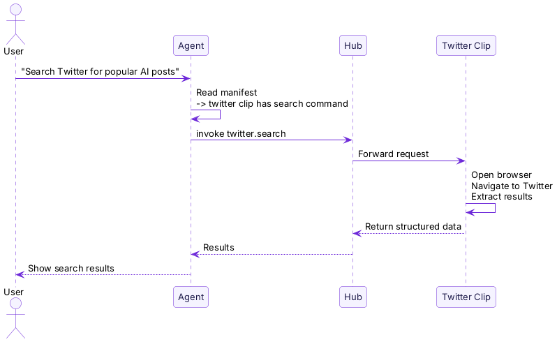

import { Aside } from "@astrojs/starlight/components";

**A Clip is an App for Agents.**

What your phone can do depends on which Apps you install. What your Agent can do depends on which Clips you install.

Install a Twitter Clip, and the Agent can search tweets. Install a Todo Clip, and the Agent can manage your tasks. Uninstall it, and the capability disappears. You fully control what the Agent can and cannot do.

## Package and Instance

Clip has two meanings, similar to the relationship between images and containers in Docker:

| | Clip Package | Clip Instance |
|---|---|---|
| Analogy | Docker image | Docker container |
| What it is | A package of code + manifest + Web UI | An instance the daemon runs after pulling the package |
| Where it is | Registry / Marketplace | On your daemon |
| How to operate it | Install with `pinix hub add` | Invoke with `pinix invoke` |

When you run `pinix hub add @pinix/todo`:
1. The daemon pulls the **package** from the Registry
2. It starts an **instance** (a Bun process)
3. It registers the instance with the Hub
4. The Agent and CLI can then invoke it

## What Clips Can Do

A Clip packages the capabilities an Agent needs. It is not just a simple function. It is a complete application with its own commands, logic, and state.

The Agent does not need to know how to operate the browser, parse the page, or handle login. All of that complex logic lives inside the Clip. Clips make Agents more capable without requiring stronger models.

<Aside type="tip">
  **Clips power Agents.** With Clips, Agents gain capabilities. Install more Clips, and Agents can do more. This is what "More Clips, More Intelligence" means.
</Aside>

## Clips Are More Than Tools

Unlike a simple API call, a Clip contains the **knowledge that lets an Agent use it correctly**:

- The **manifest** tells the Agent what the Clip can do, when to use it, and how to invoke it
- This knowledge is encoded from the Clip developer's domain expertise: the developer understands the details of the Twitter API and packages that knowledge into the Clip
- The Agent only needs to understand the manifest; it does not need to reason through those details itself

This means a **moderately capable model is enough**, because the complex judgment has already been encoded in the Clip.

## Clips Can Compose

Clips can invoke other Clips. A Twitter Clip can depend on a Browser Clip. A Research Clip can orchestrate Search + Twitter + Document Clips.

The more Clips you install, the more combinations become possible. Five Clips do not create just five capabilities. They may create dozens of different workflows, depending on the user's intent.

## Next Steps

- [pinix daemon](/concepts/daemon/) — where Clips run
- [Hub](/concepts/hub/) — how Clips are discovered and invoked
