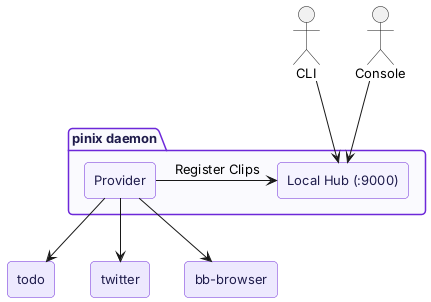
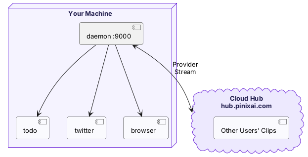

import { Aside } from "@astrojs/starlight/components";

The **pinix daemon** is the Clip runtime environment on your machine.

After `pinix start` starts the daemon, your machine can run Clips. The daemon plays two roles:

## Local Hub

The daemon includes a local Hub that listens on port :9000. The CLI, Console, and Agents use this Hub to discover and invoke Clips.

```bash
pinix hub list                    # 通过 Local Hub 查看 Clip
pinix invoke todo list            # 通过 Local Hub 调用 Clip
open http://localhost:9000        # 打开本地 Console
```

## Provider

The daemon is also a Provider. It manages the lifecycle of local Clips:

- Pull Clip packages from the Registry
- Start Clip instances (Bun processes)
- Monitor process health and restart automatically after crashes
- Register Clips with the Hub so they can be discovered and invoked



## Connect to the Cloud Hub

After you run `pinix login`, the daemon connects to the Cloud Hub (`hub.pinixai.com`). Once connected:

- **Your local Clips are accessible from the cloud**. You can also see and invoke them from the Console on other devices.
- **You can use Clips shared by others**. Shared Clips added through the Marketplace are routed to the other user's daemon.



<Aside type="tip">
  Local Hub and Cloud Hub implement the same protocol. The daemon is both the provider of the Local Hub and a Provider for the Cloud Hub.
</Aside>

## Services Started Automatically

In addition to the daemon itself, `pinix start` automatically starts:

- **bb-browser**: a browser automation Edge Clip that provides capabilities for 36 platforms, including Google, Twitter, and HackerNews
- **Chrome**: runs in headed mode, not headless, to avoid anti-automation detection

These services are managed by the daemon and stopped together when you run `pinix stop`.

## Logs

```bash
~/.pinix/logs/pinixd.log           # daemon 日志
~/.pinix/logs/<alias>.log          # 各 Clip 的日志
~/.pinix/logs/bb-browserd-*.log    # bb-browser 日志
```

## Next Steps

- [Hub](/concepts/hub/) — Hub routing
- [Local Installation](/getting-started/installation/) — how to install and start the daemon
