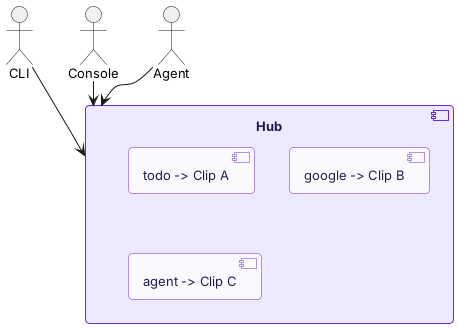
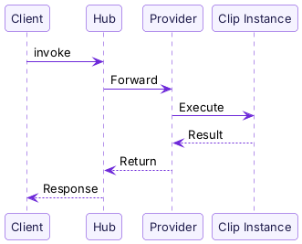

import { Aside } from "@astrojs/starlight/components";

The **Hub** is where Clips are discovered and invoked.

When you run `pinix invoke todo list`, the CLI sends the request to the Hub. The Hub finds the Clip instance for `todo` in its routing table, forwards the request, receives the result, and returns it to you. Agents invoke Clips through the same flow.

## Design Principle: The Hub Only Sees Clips

The Hub does not care how a Clip is implemented. TypeScript, Go, and native programs are all the same to the Hub. They are Clips with aliases and commands.



No type branches. No special cases.

## Alias

Each Clip has a unique **alias** on the Hub. This is the identifier used for invocation:

```bash
pinix hub add @pinix/todo          # alias: todo
pinix hub add @pinix/todo --alias my-tasks   # alias: my-tasks

pinix invoke todo list             # 通过 alias 调用
```

If no alias is specified, one is generated automatically from the package name.

## Local Hub and Cloud Hub

Pinix has two types of Hub:

| | Local Hub | Cloud Hub |
|---|---|---|
| Where it runs | On your machine, built into the daemon | hub.pinixai.com |
| Who can access it | Local CLI / Console | Any signed-in device |
| Clip sources | Locally installed Clips | Clips from all users connected to the Cloud Hub |

After `pinix login`, the daemon connects to the Cloud Hub as a Provider. Your local Clips become visible on the Cloud Hub, and you can also invoke Clips shared by others.

<Aside type="tip">
  Both Hubs implement the same protocol (`HubServiceHandler`). The only difference is scope: Local Hub serves only the local machine, while Cloud Hub serves all connected users.
</Aside>

## Invocation Flow



1. The Client (CLI / Console / Agent) sends a request to the Hub
2. The Hub checks the routing table and finds the Provider for the target Clip
3. The Provider sends the request to the Clip instance
4. The Clip executes and returns the result
5. The result is returned along the same path

Calls between Clips follow the same flow. When one Clip invokes another Clip, the call is still routed through the Hub.

## Next Steps

- [Clip vs MCP & CLI](/concepts/clip-vs-mcp/) — comparison with other tool approaches
- [Provider Protocol](/edge-clips/provider-protocol/) — how Clips connect to the Hub (advanced developer topic)
