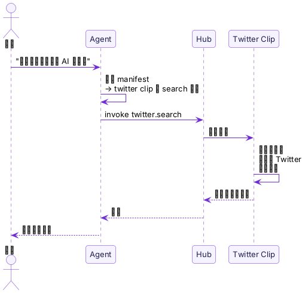

import { Aside } from "@astrojs/starlight/components";

**Clip 就是 Agent 的 App。**

你的手机能做什么，取决于你装了哪些 App。你的 Agent 能做什么，取决于你装了哪些 Clip。

安装一个 Twitter Clip，Agent 就能搜推文。安装一个待办事项 Clip，Agent 就能管理你的任务。卸载它，这个能力就消失。你完全控制 Agent 能做什么、不能做什么。

## Package 和 Instance

Clip 有两层含义，类似 Docker 中镜像和容器的关系：

| | Clip Package | Clip Instance |
|---|---|---|
| 类比 | Docker 镜像 | Docker 容器 |
| 是什么 | 代码 + manifest + Web UI 的打包 | daemon 拉取 package 后运行的实例 |
| 在哪 | Registry / Marketplace | 你的 daemon 上 |
| 怎么操作 | `pinix hub add` 安装 | `pinix invoke` 调用 |

当你执行 `pinix hub add @pinix/todo`：
1. daemon 从 Registry 拉取 **package**
2. 启动一个 **instance**（Bun 进程）
3. 把 instance 注册到 Hub
4. Agent 和 CLI 就可以调用了

## Clip 能做什么

Clip 封装了 Agent 需要的能力。它不是一个简单的函数——它是一个完整的应用，有自己的命令、逻辑和状态。

Agent 不需要知道怎么操作浏览器、怎么解析页面、怎么处理登录——这些复杂逻辑全在 Clip 里。Clip 让 Agent 变得更强大，同时不需要更强的模型。

<Aside type="tip">
  **Clip power Agent。** 有了 Clip，Agent 就有了能力。安装更多 Clip，Agent 就能做更多事。这就是 "More Clips, More Intelligence" 的含义。
</Aside>

## Clip 不只是工具

和简单的 API 调用不同，Clip 包含了**让 Agent 正确使用自己的知识**：

- **manifest** 告诉 Agent：我能做什么、什么时候该用我、怎么调用我
- 这些知识是 Clip 开发者的领域专长编码而成——开发者懂 Twitter API 的细节，把这些知识打包在 Clip 里
- Agent 只需要读懂 manifest，不需要自己推理这些细节

这意味着**中等能力的模型就够了**——因为复杂的判断已经编码在 Clip 中。

## Clip 可以组合

Clip 可以调用其他 Clip。一个 Twitter Clip 可以依赖 Browser Clip。一个 Research Clip 可以编排 Search + Twitter + Document Clip。

你安装的 Clip 越多，可能的组合就越多。5 个 Clip 不是产生 5 种能力，而是可能产生几十种不同的工作流——取决于用户的意图。

## 下一步

- [pinix daemon](/zh/concepts/daemon/)——Clip 在哪里运行
- [Hub](/zh/concepts/hub/)——Clip 如何被发现和调用
