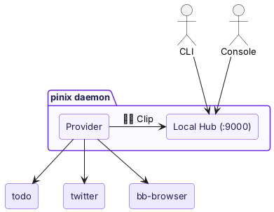
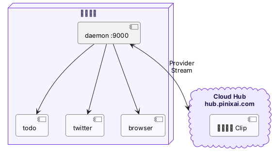

import { Aside } from "@astrojs/starlight/components";

**pinix daemon** 是你本机的 Clip 运行环境。

`pinix start` 启动 daemon 后，你的机器就可以运行 Clip 了。它同时扮演两个角色：

## Local Hub

daemon 内置了一个本地 Hub，监听在 :9000 端口。CLI、Console、Agent 通过这个 Hub 发现和调用 Clip。

```bash
pinix hub list                    # 通过 Local Hub 查看 Clip
pinix invoke todo list            # 通过 Local Hub 调用 Clip
open http://localhost:9000        # 打开本地 Console
```

## Provider

daemon 同时是一个 Provider——它管理本地 Clip 的生命周期：

- 从 Registry 拉取 Clip package
- 启动 Clip instance（Bun 进程）
- 监控进程健康，crash 自动重启
- 把 Clip 注册到 Hub，让它们可被发现和调用



## 连接 Cloud Hub

执行 `pinix login` 后，daemon 会连接到 Cloud Hub（`hub.pinixai.com`）。连接后：

- **你的本地 Clip 从云端可访问**——在其他设备的 Console 里也能看到和调用
- **你可以使用别人共享的 Clip**——通过 Marketplace 添加的共享 Clip，调用会路由到对方的 daemon



<Aside type="tip">
  Local Hub 和 Cloud Hub 实现了同一套协议。daemon 既是 Local Hub 的提供者，也是 Cloud Hub 的一个 Provider。
</Aside>

## 自动拉起的服务

`pinix start` 除了启动 daemon 本身，还会自动拉起：

- **bb-browser**——浏览器自动化 Edge Clip，提供 Google、Twitter、HackerNews 等 36 个平台的能力
- **Chrome**——headed 模式运行（不是 headless，避免反自动化检测）

这些服务由 daemon 管理，`pinix stop` 时一起停止。

## 日志

```bash
~/.pinix/logs/pinixd.log           # daemon 日志
~/.pinix/logs/<alias>.log          # 各 Clip 的日志
~/.pinix/logs/bb-browserd-*.log    # bb-browser 日志
```

## 下一步

- [Hub](/zh/concepts/hub/)——Hub 的路由机制
- [本地安装](/zh/getting-started/installation/)——如何安装和启动 daemon
