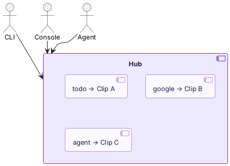
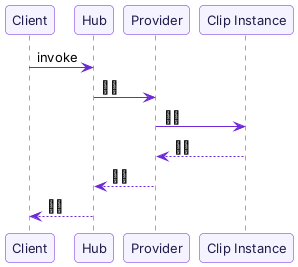

import { Aside } from "@astrojs/starlight/components";

**Hub** 是 Clip 被发现和调用的地方。

当你执行 `pinix invoke todo list`，CLI 把请求发给 Hub，Hub 在路由表里找到 `todo` 对应的 Clip instance，把请求转发过去，拿到结果返回给你。Agent 调用 Clip 也是同样的流程。

## 设计原则：Hub 只看见 Clip

Hub 不关心 Clip 是怎么实现的——TypeScript、Go、原生程序都一样。对 Hub 来说，它们都是带有 alias 和命令的 Clip。



没有类型分支，没有特殊情况。

## Alias

每个 Clip 在 Hub 上有一个唯一的 **alias**——这就是调用时的标识：

```bash
pinix hub add @pinix/todo          # alias: todo
pinix hub add @pinix/todo --alias my-tasks   # alias: my-tasks

pinix invoke todo list             # 通过 alias 调用
```

如果不指定 alias，会从包名自动生成。

## Local Hub 和 Cloud Hub

Pinix 有两种 Hub：

| | Local Hub | Cloud Hub |
|---|---|---|
| 在哪 | 你的机器上（daemon 内置） | hub.pinixai.com |
| 谁能访问 | 本机 CLI / Console | 任何登录了的设备 |
| Clip 来源 | 本地安装的 | 所有连接到 Cloud Hub 的用户的 Clip |

`pinix login` 之后，daemon 作为 Provider 连接到 Cloud Hub。你的本地 Clip 在 Cloud Hub 上可见，你也能调用别人共享的 Clip。

<Aside type="tip">
  两种 Hub 实现同一套协议（`HubServiceHandler`）。差别只在于范围：Local Hub 只服务本机，Cloud Hub 服务所有连接的用户。
</Aside>

## 调用流程



1. Client（CLI / Console / Agent）向 Hub 发请求
2. Hub 查路由表，找到目标 Clip 的 Provider
3. Provider 把请求送到 Clip instance
4. Clip 执行，返回结果
5. 沿原路返回

Clip 之间的调用也走这个流程——一个 Clip 要调另一个 Clip，一样经过 Hub 路由。

## 下一步

- [Clip vs MCP & CLI](/zh/concepts/clip-vs-mcp/)——和其他工具方案的对比
- [Provider 协议](/zh/edge-clips/provider-protocol/)——Clip 如何接入 Hub（开发者进阶）
